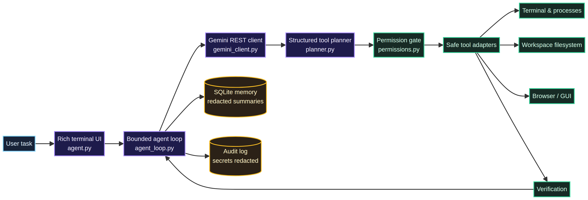

<div align="center">

# genagent

### A grounded, local-first computer agent powered by Google Gemini

**Observe → Plan → Act → Verify**

[](https://www.python.org/)
[](https://ai.google.dev/)
[](tests/)
[](#safety-first)

*A transparent terminal agent that can inspect a workspace, choose controlled tools, recover from failures, and verify its work without silently escalating privileges.*

</div>

<br />

<p align="center">
  
</p>

## Why genagent?

Most automation scripts follow a fixed sequence. **genagent** instead maintains a bounded feedback loop: it observes the current state, asks Gemini to select the smallest useful next action, executes that action through a typed tool, and verifies the result. When a command fails or a tool call repeats without progress, the agent records the observation and asks the model to recover rather than blindly retrying.

The agent is designed for local development and system tasks where the user should be able to see what is happening. Commands, permissions, workspace boundaries, timeouts, audit records, and verification are explicit parts of the system—not hidden implementation details.

## Highlights

- **Gemini-powered planning** through the official REST API, with model fallback and structured tool-call normalization.
- **Bounded autonomy** with configurable step limits, command timeouts, API retries, cancellation, and repeated-call detection.
- **Safety-first execution** with risk classification, exact-command confirmation for privileged or destructive actions, path validation, and secret redaction.
- **Workspace-aware tools** for terminal commands, filesystem operations, Python verification, processes, Git, browser adapters, and optional desktop GUI control.
- **Persistent continuity** through redacted SQLite task summaries and resumable task state.
- **Verification after change** through syntax checks, atomic self-updates, backups, and rollback when a Python update is invalid.
- **Cross-platform capability reporting** for Linux, macOS, Windows, Termux, and restricted mobile environments.
- **Platform-aware execution** with explicit Linux, Windows, Termux, and iOS-shell profiles, shell-family guidance, capability-based tool schemas, and hard guards against incompatible GUI, process, app, and shell commands.
- **Standard-library core** with no required third-party runtime dependency.
- **Enterprise-grade failure handling** with stable error codes, correlation IDs, safe public messages, structured logs, bounded retries, response-size limits, and graceful recovery across model, network, tool, SQLite, and mobile API boundaries.

## Quick start

### 1. Clone and create an environment

```bash
git clone https://github.com/Quincunx33/genagent.git
cd genagent
python3 -m venv .venv
source .venv/bin/activate
```

On Windows PowerShell, activate the environment with `.venv\\Scripts\\Activate.ps1`.

### 2. Configure Gemini

```bash
cp .env.example .env
```

Set `GEMINI_API_KEY` in `.env`. The file is ignored by Git and must never be committed.

The default model order is:

1. `gemini-3.6-flash`
2. `gemini-flash-lite-latest`
3. `gemini-3.6-flash`

You can override the order with `GEMINI_MODEL` and `GEMINI_FALLBACK_MODELS`.

### 3. Run the agent

```bash
python agent.py
```

Example task:

```text
Inspect this project, find the failing tests, make the smallest safe fix, run the test suite, and report what was verified.
```

## Common commands

| Command | Purpose |
| --- | --- |
| `/help` | Show available commands. |
| `/status` | Show model, workspace, and execution settings. |
| `/tools` | List the available tools. |
| `/model` | Show the active Gemini model. |
| `/workspace` | Show the configured workspace. |
| `/permissions` | Explain the permission policy. |
| `/memory` | Review relevant stored task context. |
| `/clear-memory` | Clear redacted agent memories. |
| `/tasks` | List persisted tasks. |
| `/resume TASK_ID` | Resume a paused task. |
| `/exit` | Exit the agent. |

## Safety first

> **genagent never treats autonomy as permission to hide actions.** The user remains in control of privileged and destructive work.

The permission layer classifies actions as normal, low-risk, privileged, or destructive. Normal read-only inspection can run automatically. Privileged and destructive operations display the exact command and require an explicit confirmation. The agent does not bypass operating-system authentication, extract credentials, store API keys in memory, or implement CAPTCHA bypass, credential theft, stealth scraping, or unauthorized access.

The default workspace boundary prevents accidental writes outside the configured project. File sizes, output sizes, API retries, command duration, and total agent steps are configurable. Runtime databases, JSONL audit logs, command history, and secrets are local-only artifacts and are excluded by `.gitignore`.

## Architecture

The main modules have one responsibility each:

- `agent.py` provides the interactive terminal UI and slash commands.
- `agent_loop.py` coordinates the bounded observe-plan-act-verify cycle.
- `gemini_client.py` isolates Gemini requests, retries, and tool-call parsing.
- `errors.py` defines the stable error taxonomy, correlation IDs, safe public payloads, and retry classification.
- `planner.py` defines the structured tool schemas exposed to Gemini.
- `permissions.py` classifies risk and handles confirmation.
- `tools/` contains terminal, filesystem, process, Git, browser, GUI, and verification adapters.
- `memory.py`, `state.py`, and `task_store.py` provide redacted continuity and resumable task state.
- `security.py` handles secret redaction and audit protections.
- `text_safety.py` prevents malformed Unicode from terminating terminal sessions on macOS and iPadOS boundaries.

## Optional adapters

The core agent runs with Python's standard library. Optional capabilities can be enabled only when needed:

- **Browser automation:** install Playwright and its browser runtime for browser helpers.
- **Desktop GUI:** install PyAutoGUI on a trusted desktop with the required accessibility/display permissions.
- **OCR:** install the native `tesseract` executable.
- **Mobile bridge:** run `python mobile_server.py --host 127.0.0.1 --port 8765`. The bridge requires a bearer token and should remain loopback-only unless a trusted private network, HTTPS, firewall rules, and a long random token are configured.

## Configuration

Configuration is loaded from environment variables or `.env`:

| Variable | Default | Meaning |
| --- | --- | --- |
| `GEMINI_MODEL` | `gemini-3.6-flash` | Primary Gemini model. |
| `GEMINI_FALLBACK_MODELS` | See `.env.example` | Comma-separated fallback models. |
| `AGENT_WORKSPACE` | Current directory | Filesystem boundary for the agent. |
| `MAX_AGENT_STEPS` | `50` | Maximum steps in one task. |
| `COMMAND_TIMEOUT` | `120` | Maximum seconds for a command. |
| `API_RETRIES` | `3` | Maximum attempts per Gemini model for retryable network/API failures. |
| `MAX_API_RESPONSE_BYTES` | `4194304` | Maximum accepted Gemini response size. |
| `MAX_PROMPT_CHARS` | `16000` | Hard cap for each generated prompt. |
| `MAX_HISTORY_CHARS` | `12000` | Newest conversation/tool history retained per API call. |
| `MAX_MEMORY_CHARS` | `3000` | Maximum relevant long-term memory included in a prompt. |
| `MAX_TOOL_RESULT_CHARS` | `5000` | Maximum serialized result retained for one tool observation. |
| `RESPONSE_CACHE_ENABLED` | `true` | Enable bounded in-process caching for identical final text responses. |
| `RESPONSE_CACHE_TTL` | `300` | Cache lifetime in seconds. Tool-call responses are never cached. |
| `RESPONSE_CACHE_SIZE` | `128` | Maximum cached responses per process. |
| `TASK_TOOL_FILTERING` | `true` | Send only task-relevant tool schemas when intent is clear. |
| `GEMINI_FAST_MODEL` | `gemini-flash-lite-latest` | First model for short read-only/status requests. |
| `MAX_RETRIES` | `3` | Recovery retry limit. |
| `REQUIRE_CONFIRMATION` | `true` | Require confirmation for protected actions. |
| `AGENT_DB` | User home directory | Local SQLite task state path. |
| `AGENT_AUDIT_LOG` | User home directory | Local redacted JSONL audit path. |
| `LOG_ROTATE_HOURS` | `24` | Rotate the active audit log after this many hours; rotation is checked before every write. |
| `LOG_RETENTION` | `7` | Number of rotated audit archives to retain. |

## Development

Run the complete test suite with:

```bash
python -m unittest discover -s tests -p 'test_*.py'
```

The project includes regression coverage for command execution, timeout handling, filesystem safety, permissions, Gemini protocol normalization, memory redaction, mobile authentication, self-update rollback, task persistence, and Unicode surrogate handling. Do not run destructive tests against a real user filesystem.

### Error handling contract

All external failures are normalized into stable error codes such as `TIMEOUT`, `NETWORK_ERROR`, `API_AUTH_ERROR`, `API_HTTP_ERROR`, `INVALID_RESPONSE`, `PERMISSION_DENIED`, and `INTERNAL_ERROR`. User-facing responses contain a bounded safe message and an `error_id`; secrets, API keys, command output credentials, and stack traces are excluded from public responses. Retryable model failures use bounded exponential backoff with jitter and model fallback, while authentication and malformed-request failures fail fast. Structured JSON logs and the mobile bridge audit log retain correlation IDs and redacted diagnostics for incident investigation. The active audit log automatically rotates after **24 hours by default**, starts a fresh JSONL file, and retains only the configured number of timestamped archives; this is lazy and deterministic, so it needs no external scheduler or dependency.

### Cross-platform execution

At startup and before each task, the agent detects a concrete profile: `linux`, `windows`, `termux`, `ios_shell`, `macos`, or `unknown`. The profile includes the shell family, display state, GUI backend, supported tools, and unsupported tools. The model receives this information as authoritative context. Tool schemas are filtered against the profile, and direct dispatch performs a second guard, so an iOS shell cannot receive desktop GUI/process controls, Termux cannot receive desktop launcher/GUI actions, and Windows rejects obvious POSIX/Linux commands. Windows tasks are guided toward `cmd.exe`/PowerShell syntax; Linux/macOS/Termux tasks use POSIX syntax only when the command is available.

### Token optimization

The agent keeps the newest conversation and tool observations within explicit character budgets instead of resending an unbounded transcript on every step. Long tool output is clipped before it enters history, relevant memory is capped, and tool descriptions are intentionally concise. These controls reduce repeated input tokens while preserving the latest evidence and all permission/safety checks. Tune the four `MAX_*_CHARS` settings only when a task genuinely needs more context; increasing them increases cost on every model step.

Identical final text responses are cached in memory with a short TTL; tool-call responses are intentionally excluded so stale actions are never replayed. Repeated identical tool observations are stored as compact references. Clear task intent selects a smaller tool schema, while ambiguous requests retain the full schema for safety. Short read-only requests prefer `GEMINI_FAST_MODEL`; write or ambiguous tasks keep the normal model order.

## Repository hygiene

The repository intentionally excludes `.env`, virtual environments, Python caches, SQLite databases, JSONL audit logs, command history, and local log files. Commit `.env.example` when configuration fields change, but never commit a real API key or runtime state.

## License and status

This project is an actively developed experimental agent framework. Review every proposed command before approving it, especially when the workspace or host system contains sensitive data.

## References

[1]: https://ai.google.dev/gemini-api/docs "Gemini API documentation"
[2]: https://docs.python.org/3.11/library/venv.html "Python virtual environment documentation"
[3]: https://docs.python.org/3.11/library/unittest.html "Python unittest documentation"
